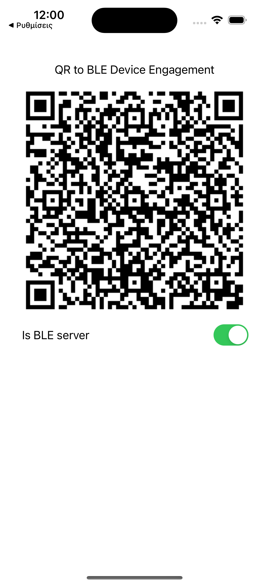

# EUID Wallet Prototype v.0.05 for Proximity use case

## About

This repository contains a demo *mdoc holder* iOS application, according to [ISO/IEC 18013-5](https://www.iso.org/standard/69084.html).

At present, device engagement using QR code is available.

## Screenshots

