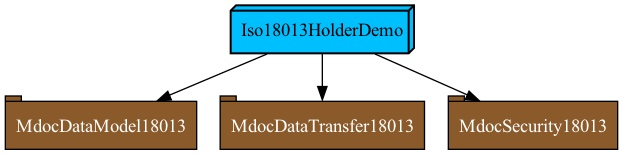

# EUDI Wallet Prototype v.0.1 for Proximity use case

## About

This repository contains a demo *mdoc holder* iOS application, according to [ISO/IEC 18013-5](https://www.iso.org/standard/69084.html).
At the present time, the following features are available:

- Device engagement using QR code.
- Loading of wallet data from CBOR bytes
- Data transfer using Bluetooth Low Energy (BLE)

### Dependencies

The core functionality of the app is implemented in our ISO-18013 Swift Packages: [Data-Model](https://github.com/eu-digital-identity-wallet/eudi-lib-ios-iso18013-data-model.git), [Security](https://github.com/eu-digital-identity-wallet/eudi-lib-ios-iso18013-security.git) and [Data-Transfer](https://github.com/eu-digital-identity-wallet/eudi-lib-ios-iso18013-data-transfer.git)

The following image depicts the app architecture: .

You can regenerate the Xcode project using [Tuist](https://tuist.io) by running `tuist generate` in the root folder of the project. 

### Sample Data

Currently sample data is used. For more information on how to use sample data for testing mdoc
and eupid, see in [SAMPLE_DATA.md](wiki/SAMPLE_DATA.md).

**Note: PID sample is a technical sample and it does not implement the data model of PID yet.**

### Testing

See [wiki/TEST.md](wiki/TEST.md) for how to test EUDI Holder App using an mDoc Verifier App

### Demo Video

[Demo video](https://github.com/eu-digital-identity-wallet/eudi-app-ios-iso18013-holder-demo/assets/4129573/a998e6ac-ab1e-4c08-9f2e-983c0b4433bd)

