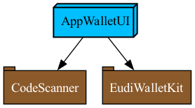

# EUDI Wallet Reference Implementation

:heavy_exclamation_mark: **Important!** Before you proceed, please read the [EUDI Wallet Reference Implementation project description](wiki/EUDI_Wallet_Reference_Implementation.md)

----

# EUDI Wallet Prototype v.0.2 for Proximity use case

## About

This repository contains a demo *mdoc holder* iOS application, according to [ISO/IEC 18013-5](https://www.iso.org/standard/69084.html).
At the present time, the following features are available:

- Device engagement using QR code.
- Loading of wallet data from CBOR bytes
- Data transfer using Bluetooth Low Energy (BLE)

### Dependencies

The core functionality of the app is implemented in [Wallet Kit](https://github.com/eu-digital-identity-wallet/eudi-lib-ios-wallet-kit) package. Wallet Kit dependes on ISO-18013 Swift Packages: [Data-Model](https://github.com/eu-digital-identity-wallet/eudi-lib-ios-iso18013-data-model.git), [Security](https://github.com/eu-digital-identity-wallet/eudi-lib-ios-iso18013-security.git), [Data-Transfer](https://github.com/eu-digital-identity-wallet/eudi-lib-ios-iso18013-data-transfer.git) and [OpenID4VP](https://github.com/eu-digital-identity-wallet/eudi-lib-ios-siop-openid4vp-swift) package.

The following image depicts the app package dependencies: .

You can regenerate the Xcode project using [Tuist](https://tuist.io) by running `tuist generate` in the root folder of the project. 

### Sample Data

Currently sample data is used. For more information on how to use sample data for testing mdoc
and eupid, see in [SAMPLE_DATA.md](wiki/SAMPLE_DATA.md).

**Note: PID sample is a technical sample and it does not implement the data model of PID yet.**

### Testing

See [wiki/TEST.md](wiki/TEST.md) for how to test EUDI Holder App using an mDoc Verifier App

### Demo Video

[Demo video](https://github.com/eu-digital-identity-wallet/eudi-app-ios-iso18013-holder-demo/assets/4129573/a998e6ac-ab1e-4c08-9f2e-983c0b4433bd)

### Disclaimer
The released software is a initial development release version: 
-  The initial development release is an early endeavor reflecting the efforts of a short timeboxed period, and by no means can be considered as the final product.  
-  The initial development release may be changed substantially over time, might introduce new features but also may change or remove existing ones, potentially breaking compatibility with your existing code.
-  The initial development release is limited in functional scope.
-  The initial development release may contain errors or design flaws and other problems that could cause system or other failures and data loss.
-  The initial development release has reduced security, privacy, availability, and reliability standards relative to future releases. This could make the software slower, less reliable, or more vulnerable to attacks than mature software.
-  The initial development release is not yet comprehensively documented. 
-  Users of the software must perform sufficient engineering and additional testing in order to properly evaluate their application and determine whether any of the open-sourced components is suitable for use in that application.
-  We strongly recommend to not put this version of the software into production use.
-  Only the latest version of the software will be supported

### Third party packages

|Package name | Url|
|--- | ---|
|ASN1Decoder |https://github.com/filom/ASN1Decoder |
|SwiftLog |https://github.com/apple/swift-log.git |
|SwiftCBOR |https://github.com/valpackett/SwiftCBOR.git |

### License details

Copyright (c) 2023 European Commission

Licensed under the Apache License, Version 2.0 (the "License");
you may not use this file except in compliance with the License.
You may obtain a copy of the License at

    http://www.apache.org/licenses/LICENSE-2.0

Unless required by applicable law or agreed to in writing, software
distributed under the License is distributed on an "AS IS" BASIS,
WITHOUT WARRANTIES OR CONDITIONS OF ANY KIND, either express or implied.
See the License for the specific language governing permissions and
limitations under the License.